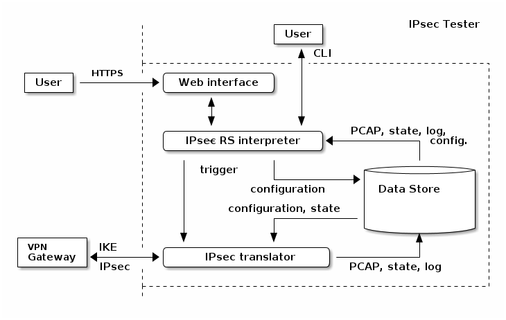

# IPsec Tester

This is a system usable for learning and possible debugging IPsec.

It consists of

* an IPsec translator, that talks IKE and IPsec on the network
* a data store that holds configuration and ephemeral data like packet
  captures, logs, state
* the IPsec RS interpreter that can interpret the data in the store and
  trigger actions of the IPsec translator

The purpose of the system is to find a uniform vocabulary for the
configuration and state of IPsec implementations from different vendors.

To use the system you would either connect with an web browser to the IPsec RS
interpreter to define the configuration of an IPsec connection or you could
use the command line interface of the interpreter.

Afterwards you can connect with your IPsec gateway to the IPsec translator
and try to get a VPN tunnel established.

Alternatively you could trigger the IPsec translator to establish a VPN
tunnel to your gateway.

In the interpreter you can see the view from the other side of the VPN tunnel.

